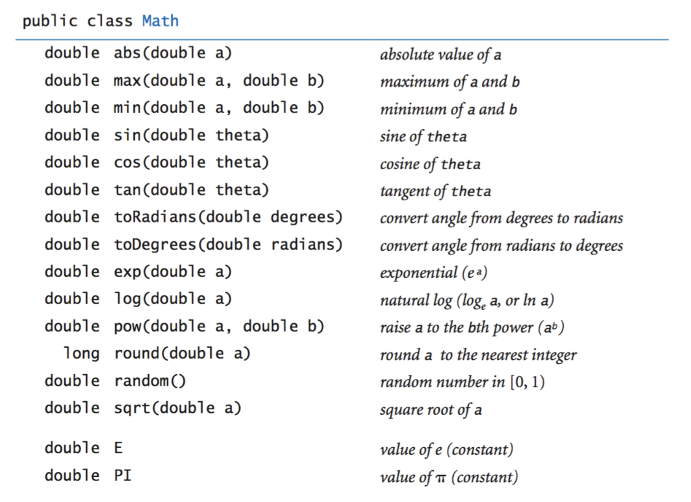

# java-interview-prep
## Description
My preparation for a Java interview. Includes notes, sample programs, and resources I used.

# Game Plan

## Step One: Review General Java Development
Do I have previous experience? Yes.
Am I still rusty? Yes.

# Java Fundementals
```java
// This is the name of the file ( Sample Program.java )
public class SampleProgram
{
  // Main method that is run when the program starts
  public static void main(String[] args)
  {
    // Printing out to the console with the System class defined in java.lang.package
    // out is an instance of the PrintSystem type under the System class.
    // print() does what it says and prints to the console using the print method. 
    // An improved version of this method is println()
    // This prints to the console and adds a newline character to the end of the line.
    System.out.print("This is a simple Java Program.")
  }
}
```

A Java program is complied and executed in a series of steps.
## Compilation
```bash
# This line is typed into the terminal to compile the
# program from source code to Java bytecodes.
javac SampleProgram.java
```
## Execution
Once complied, a file `SampleProgram.class` is created that we can then execute the program using `java SampleProgram` which uses the JVM to run the code.

__important term__:
JVM is the Java Virtual Machine that enables a computer to run Java programs as well as programs written in other languages that are also compiled to Java bytecode. The JVM is detailed by a specification that formally describes what is required in a JVM implementation.
( wikipedia )

# Primiative Data Types
`int` - integer values, whole numbers with a maximum value of $2^{31}-1$ ( $2,147,483,647$ ). [Java Documentation - Intergers](https://docs.oracle.com/javase/7/docs/api/java/lang/Integer.html)

`double` - floating point values, decimal values with a maximum value of $−1.111⋯1×2^{1023} - 1.111⋯1×2^{1023}$. [Java Documentation - Doubles](https://docs.oracle.com/javase/7/docs/api/java/lang/Double.html)

`boolean` - true / false values. [Java Documentation - Booleans](https://docs.oracle.com/javase/8/docs/api/java/lang/Boolean.html)

`char` - single characters. [Java Documentation - Characters](https://docs.oracle.com/javase/tutorial/java/data/characters.html)

`String` - An array of characters. [Java Documentation - Strings](https://docs.oracle.com/javase/7/docs/api/java/lang/String.html)

## Variable Declaration and Assignment
```java
// [ variable type ] [ variable name ];
int n;
int a, b;
// [ variable name ] [ assignment operator ];
n = 10;
a = 0;
b = 25;
// This is an example of an inline initalization
int delta_x = ( b - a ) / n;
```

## Comparison Operators
`==` : Equal.

`!=` : Not equal.

`<` : Less than.

`<=`: Less than or equal.

`>` : Greater than.

`>=` : Greater than or equal.

## Examples
### Using Comparison Operators
```java
boolean non_negative_discriminant = ( b * b - 4.0 * a * c ) >= 0.0;
boolean start_of_century = ( year % 100 ) == 0;
boolean valid_month = ( month >= 1 ) && ( month <= 12 );
```
### Printing to the console.
```java
void System.out.print("Hello there!\n");
void System.out.println("General Kenobi...");
```
### Evaluating Command Line Arguments
```java
int Integer.parseInt(String "100"); // returns int of 100
double Double.parseDouble(String "3.14159") // returns double with value 3.14159
long Long.parseLong(String "9223372036854775808") // returns long with value of 9223372036854775808 ( the maximum value )
```
## The Java Math Library
A variety of math operations are available in the `public class Math` library. 


[Math API Documentation](https://docs.oracle.com/javase/8/docs/api/java/lang/Math.html)

## If - Else Statements
```java
if(superhero == "Superman")
{
    bird_or_plane = false;
}
else if(superhero == "Batman")
{
    is_the_night = true;
}
else
{
  System.out.println("I don't know this superhero...");
}
```
### Alternative Syntax
```java
if(superhero == "Superman") bird_or_plane = false;
else if(superhero == "Batman") is_the_night = true;
else System.out.println("I don't know this superhero...");
```
## Loops
### For Loops
```java
```
### While Loops
```java
```
### Do While Loops
```java
```

## Switch Statements
```java
```
# Functions
```java
// [ signature ] public static
// [ return type ] int
// [ method name ] absoluteValue
// [ argument type ] int
// [ argument variable ] num
public static int absoluteValue(int num)
{
    if(num < 0) return -num;
    else return num;
}
```

# Other Pages
## [Data Structures](DataStructures.md)
## [Algorithms](Algorithms.md)

# Useful Links
[Java Cheatsheet - Princeton](https://introcs.cs.princeton.edu/java/11cheatsheet/)